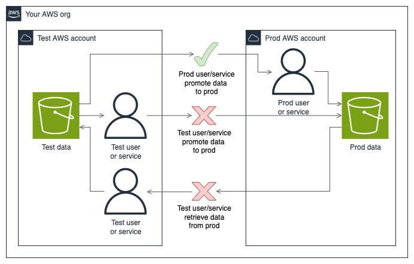
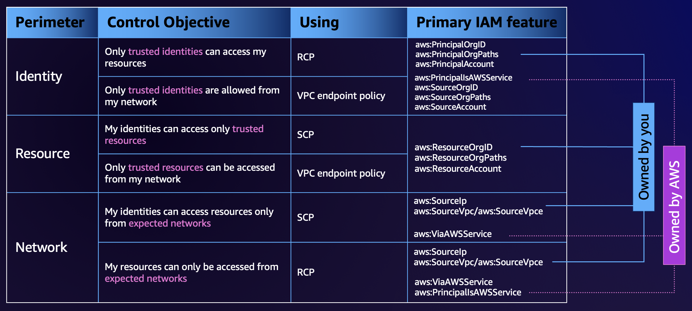
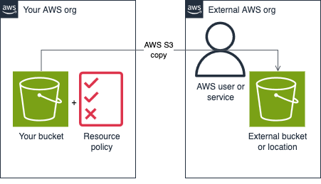

# AWS Data Perimeter

A repository to demo how to setup an AWS data perimeter.

# What is a Data Perimeter

:horse: From the horses mouth AWS has its own documentation on [what a data perimeter is][aws-data-perimeter].

However to give you the TLDR we're trying to achieve 2 things in this project:

1. Stop data moving across AWS org OUs (e.g. don't let prod data get into dev/sandbox/test accounts)
2. Stop data leaving our AWS org

AWS accounts by default are isolated from each other so data can't really move across them. However a developer could set a resource policy (e.g. S3 bucket policy) that allows data to move across accounts.

A data perimeter is a guardrail to let developers still set policies to move data but only to places we trust. This then helps prevent misconfiguration or a bad actor trying to move data to where it shouldn't be.

# What Resources are Included

In this demo project we're **only covering S3** for simplicity. However the practices still apply to other AWS services that store data (e.g. DynamoDB).

# Implementation

## Stop Data Moving Across AWS Org OUs

Within our own AWS org we can use SCPs as guardrails so data does not move between accounts where we don’t want it to.

An example setup you may want to have is;

1. No users/services can move (demote) data from prod to non-prod accounts
2. Non-prod users/services can't move (promote) data from a non-prod to prod account
3. Prod user/services can move (promote) data from a non-prod to prod account



Developers can write resource policies that bypass the restrictions mentioned above but we can use SCPs to block any misconfigured resources at a higher level.

On non-prod OUs and accounts we add the SCP;

```
{
  "Version": "2012-10-17",
  "Statement": [
    {
      "Sid": "BlockDataGoingToOrFromProd",
      "Effect": "Deny",
      "Action": [
        "s3:*",
      ],
      "Resource": [
        "*"
      ],
      "Condition": {
        "ForAnyValue:StringLike": {
          "aws:ResourceOrgPaths": [
            "o-ORG_ID/r-ROOT_OU_ID/ou-NESTED_OU_ID/*"
          ]
        }
      }
    }
  ]
}
```

In the above you'll need to change `"o-ORG_ID/r-ROOT_OU_ID/ou-PROD_OU_ID/*"` replacing `o-ORG_ID`, `r-ROOT_OU_ID` and `ou-PROD_OU_ID` to match those in your own AWS org for your prod OUs.

The above policy is then attached to any non-prod OUs. This will block any S3 actions from those non-prod OUs that target the prod OUs. So a non-prod user/service cannot for instance copy data to or form a production S3 bucket.

On prod OUs and accounts we add the SCP;

```
{
  "Version": "2012-10-17",
  "Statement": [
    {
      "Sid": "BlockDataGoingToNonProd",
      "Effect": "Deny",
      "Action": [
        "s3:Put*",
      ],
      "Resource": [
        "*"
      ],
      "Condition": {
        "ForAnyValue:StringNotLike": {
          "aws:ResourceOrgPaths": [
            "o-ORG_ID/r-ROOT_OU_ID/ou-NESTED_OU_ID/*"
          ]
        }
      }
    }
  ]
}
```

In the above you'll need to again change `"o-ORG_ID/r-ROOT_OU_ID/ou-PROD_OU_ID/*"` replacing `o-ORG_ID`, `r-ROOT_OU_ID` and `ou-PROD_OU_ID` to match those in your AWS org for your prod OUs.

Note the difference in this second policy where we use the condition `ForAnyValue:StringNotLike` instead of `ForAnyValue:StringLike`. And we only have `s3:Put*` in that are denied in the Actions.

This policy stops prod users/services copying (putting) objects from the prod OUs to other OUs that are not also in the prod OUs. We don't block all S3 actions as we still want to be able to get objects from other OUs for the scenario where we promote data from non prod to prod.

## Stop Data Leaving Our AWS Org

So while SCPs are great at providing guard rails within our AWS org they don't protect us from user/services outside our org.

As the table from the AWS docs below shows, for the control objective of "My identities can access only trusted resources" SCPs can be used. However for the objective "Only trusted identities can access my resources" you need to use resource control policies (RCPs).



The difference is the former means SCPs control identities within your org while RCPs need to be used to control anything from outside the org.

So an example if we had a malicious AWS account/user outside or org calling something like `aws s3api get-object` our SCPs would be useless since we need to check `aws:PrincipalOrgID`.

The diagram below depicts a S3 bucket in our org with a bucket policy that is too loose. It allows access from any service/principal regardless of which account or org it comes from.



The policy could look something like;

```
{
  "Version": "2012-10-17",
  "Statement": [
    {
      "Effect": "Allow",
      "Principal": {
        "AWS": "*"
      },
      "Action": [
        "s3:ListBucket",
        "s3:GetObject"
      ],
      "Resource": [
        "arn:aws:s3:::not-super-secure/*",
        "arn:aws:s3:::not-super-secure"
      ]
    }
  ]
}
```

To test this we can add a file to the bucket. Then from another AWS account outside our current org use the AWS CLI to grab that file.

```
aws s3api get-object --bucket not-super-secure --key data.txt data.txt
```

Because in this scenario the user/service is outside our current AWS org we can't use a SCP to protect the bucket. We instead need to ensure the bucket policy has a statement that blocks access from outside the org. Such a statement would look something like;

```
{
  "Effect": "Deny",
  "Principal": "*",
  "Action": "s3:*",
  "Resource": [
    "arn:aws:s3:::not-super-secure/*",
    "arn:aws:s3:::not-super-secure"
  ],
  "Condition": {
    "StringNotEquals": {
      "aws:PrincipalOrgID": "o-ORG_ID"
    }
  }
}
```

With this statement added the copy command from another AWS account outside our org used earlier does not work even if the bucket policy also includes the misconfigured statement allowing access from any service/principal.

The issue we face now is while we can add this statement to deny access, someone may just modify the policy and remove it. We also need to apply this to every resource and can't have an overarching guardrail like we do with SCPs.

To solve this we can use AWS Config to monitor our bucket policies. We can have AWS Config monitor and notify us when a bucket is not in compliance. We can also configure AWS Config to take automated action to re-add the statement that blocks access from outside our org.

<todo add terraform module to monitor + optionally remediate>


[aws-data-perimeter]: https://aws.amazon.com/identity/data-perimeters-on-aws/